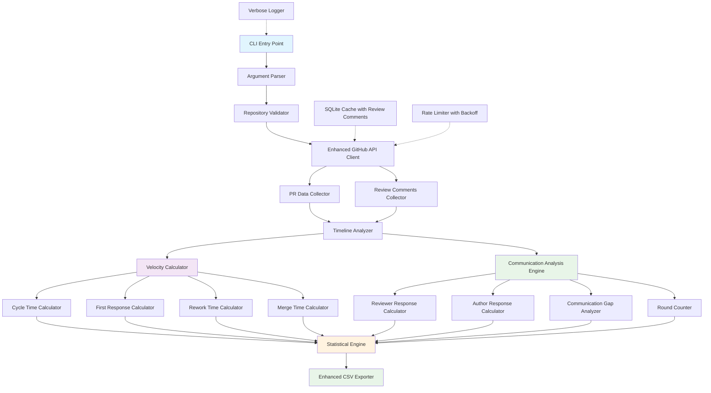
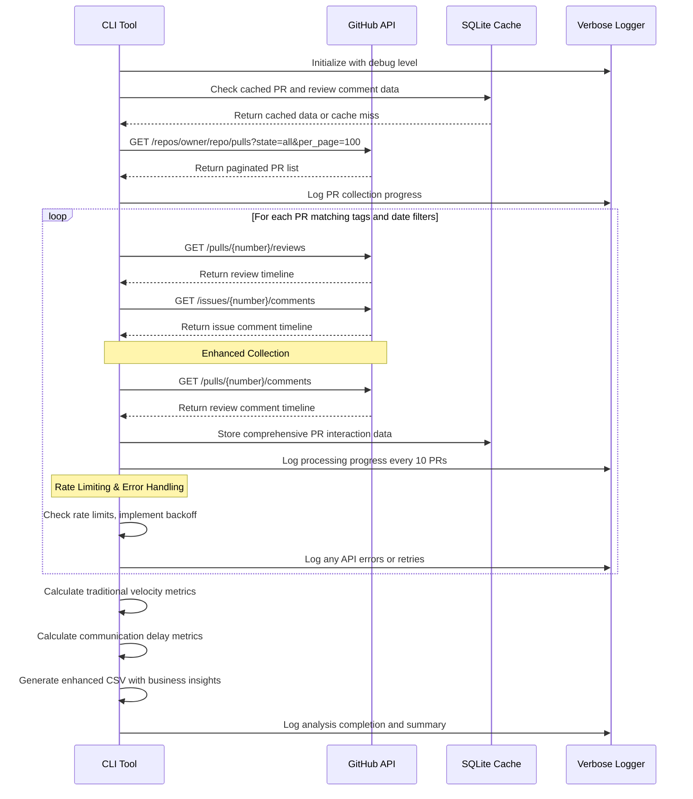
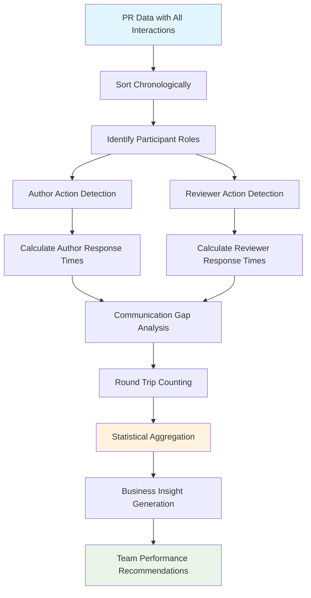

# PR Analytics Tool Architecture

## Business Value Overview

The PR Analytics Tool has been enhanced with **Communication Delay Metrics** to provide deeper insights into team collaboration patterns and identify bottlenecks in the code review process. These metrics help engineering leaders:

- **Identify collaboration bottlenecks** through reviewer-to-author and author-to-reviewer response time analysis
- **Improve team efficiency** by recognizing communication gaps and slow response patterns
- **Guide coaching decisions** with data-driven insights into individual and team performance
- **Optimize review processes** by understanding where delays occur in the PR lifecycle

### Key Business Insights
- **Response Time Patterns**: Understand how quickly team members respond to reviews and feedback
- **Communication Health**: Identify silent periods that may indicate blocked or forgotten PRs
- **Team Dynamics**: Compare collaboration efficiency across different teams and time periods
- **Process Optimization**: Use data to guide improvements in review workflows and team practices

## Enhanced CLI Design

```bash
# Basic usage with communication analytics
python pr_velocity_analytics.py --repo owner/repo --tags "frontend,bug-fix"

# Verbose output for detailed communication insights
python pr_velocity_analytics.py --repo owner/repo --tags "feature" --verbose

# Time-filtered analysis with author grouping for team comparison
python pr_velocity_analytics.py --repo owner/repo --tags "feature" --since 2024-01-01 --group-by author

# Custom output with enhanced communication metrics
python pr_velocity_analytics.py --repo owner/repo --tags "hotfix,urgent" --since 30d --output team_analysis.csv
```

## Enhanced System Architecture



## Enhanced Data Models

### PRVelocityMetrics with Communication Delays
```python
@dataclass
class PRVelocityMetrics:
    # Core PR Information
    pr_number: int
    title: str
    author: str
    labels: List[str]
    created_at: datetime
    
    # Timeline Events
    first_review_at: Optional[datetime] = None
    first_comment_at: Optional[datetime] = None
    changes_requested_at: Optional[datetime] = None
    approved_at: Optional[datetime] = None
    merged_at: Optional[datetime] = None
    
    # Traditional Velocity Metrics
    cycle_time_hours: Optional[float] = None                    # Business: Overall delivery speed
    first_response_time_hours: Optional[float] = None          # Business: Team responsiveness
    rework_time_hours: Optional[float] = None                  # Business: Quality and clarity
    merge_time_hours: Optional[float] = None                   # Business: Deployment readiness
    
    # Enhanced Communication Delay Metrics
    avg_reviewer_to_author_hours: Optional[float] = None       # Business: Reviewer engagement speed
    avg_author_to_reviewer_hours: Optional[float] = None       # Business: Author response efficiency
    max_communication_gap_hours: Optional[float] = None        # Business: Risk of forgotten PRs
    communication_rounds_count: Optional[int] = None           # Business: Collaboration intensity
```

### Statistical Summary
```python
@dataclass
class MetricSummary:
    metric_name: str
    count: int
    p50_median: float
    p75: float
    p90: float
    p99: float
    mean: float
    std_dev: float
```

## Communication Delay Metrics Methodology

### 5. Reviewer-to-Author Response Time
**Business Value**: Identifies reviewers who may need coaching on responsiveness or workload management  
**Definition**: Average time for reviewers to respond when authors update PRs or address feedback  
**Technical Data Collection**:
- PR review comments with timestamps (GitHub API: `/repos/{owner}/{repo}/pulls/{number}/comments`)
- Review submissions with timestamps (GitHub API: `/repos/{owner}/{repo}/pulls/{number}/reviews`)
- PR update events (commits, push events)
**Algorithm**: 
```python
reviewer_response_times = []
for author_action in author_timeline:
    next_reviewer_action = find_next_reviewer_interaction(author_action.timestamp)
    if next_reviewer_action:
        response_time = (next_reviewer_action.timestamp - author_action.timestamp).total_seconds() / 3600
        reviewer_response_times.append(response_time)
avg_reviewer_to_author_hours = mean(reviewer_response_times) if reviewer_response_times else None
```
**Business Impact**: Teams with high reviewer response times (>24hrs) may need process improvements

### 6. Author-to-Reviewer Response Time  
**Business Value**: Measures author engagement and identifies potential blockers in PR progression  
**Definition**: Average time for authors to address reviewer feedback and comments  
**Technical Data Collection**:
- Review events with state changes
- PR commits and updates following reviews
- Review comment responses from authors
**Algorithm**:
```python
author_response_times = []
for reviewer_action in reviewer_timeline:
    next_author_action = find_next_author_interaction(reviewer_action.timestamp)
    if next_author_action:
        response_time = (next_author_action.timestamp - reviewer_action.timestamp).total_seconds() / 3600
        author_response_times.append(response_time)
avg_author_to_reviewer_hours = mean(author_response_times) if author_response_times else None
```
**Business Impact**: Authors with slow response times may need priority clarification or technical support

### 7. Maximum Communication Gap
**Business Value**: Identifies PRs at risk of being forgotten or abandoned  
**Definition**: Longest period of silence between any communications in the PR lifecycle  
**Technical Data Collection**:
- All interaction timestamps sorted chronologically
- Gap analysis between consecutive events
**Algorithm**:
```python
all_interactions = sorted(reviews + comments + commits, key=lambda x: x.timestamp)
max_gap_hours = 0
for i in range(1, len(all_interactions)):
    gap = (all_interactions[i].timestamp - all_interactions[i-1].timestamp).total_seconds() / 3600
    max_gap_hours = max(max_gap_hours, gap)
```
**Business Impact**: Gaps >72hrs often indicate process breakdowns requiring intervention

### 8. Communication Rounds Count
**Business Value**: Indicates collaboration intensity and potential scope or clarity issues  
**Definition**: Number of back-and-forth communication cycles between authors and reviewers  
**Technical Data Collection**:
- Sequential analysis of author vs reviewer interactions
- Round detection based on participant role changes
**Algorithm**:
```python
rounds = 0
last_participant_type = None
for interaction in sorted_interactions:
    current_participant_type = 'author' if interaction.user == pr.author else 'reviewer'
    if last_participant_type and last_participant_type != current_participant_type:
        rounds += 1
    last_participant_type = current_participant_type
communication_rounds_count = rounds // 2  # Convert to round-trip cycles
```
**Business Impact**: High round counts (>5) may indicate unclear requirements or scope creep

## Real-World Business Use Cases

### Use Case 1: Identifying Slow Reviewers
**Scenario**: Engineering manager notices PRs are taking longer to merge  
**Metrics Used**: `avg_reviewer_to_author_hours`, `first_response_time_hours`  
**Action**: Filter data by team, identify reviewers with >48hr response times  
**Business Outcome**: Targeted coaching or workload redistribution to improve team velocity

### Use Case 2: Detecting Communication Gaps
**Scenario**: PRs are being forgotten or abandoned  
**Metrics Used**: `max_communication_gap_hours`, `communication_rounds_count`  
**Action**: Set up alerts for PRs with >72hr communication gaps  
**Business Outcome**: Reduced PR abandonment rate and improved delivery predictability

### Use Case 3: Optimizing Review Processes
**Scenario**: Team wants to improve collaboration efficiency  
**Metrics Used**: All communication delay metrics with author grouping  
**Action**: Compare high-performing vs struggling team patterns  
**Business Outcome**: Process improvements based on data-driven insights

### Use Case 4: Author Performance Coaching
**Scenario**: Some developers are slow to address review feedback  
**Metrics Used**: `avg_author_to_reviewer_hours`, `rework_time_hours`  
**Action**: Identify authors with consistently slow response times  
**Business Outcome**: Targeted mentoring and skill development programs

## Enhanced GitHub API Data Collection Strategy



## Communication Timeline Analysis Workflow



## Team Performance Insights and Recommendations

### High-Performing Team Patterns
- **Reviewer Response Time**: < 8 hours average
- **Author Response Time**: < 4 hours average  
- **Communication Gaps**: < 24 hours maximum
- **Communication Rounds**: 2-3 rounds average

### Red Flag Indicators
- **Reviewer Response Time**: > 48 hours (coaching needed)
- **Author Response Time**: > 24 hours (potential blockers)
- **Communication Gaps**: > 72 hours (process breakdown)
- **Communication Rounds**: > 6 rounds (scope/clarity issues)

### Actionable Recommendations
1. **For Slow Reviewers**: Implement review rotation, workload balancing
2. **For Slow Authors**: Provide technical support, priority clarification
3. **For Communication Gaps**: Set up automated reminders, improve notification systems
4. **For High Round Counts**: Improve requirement clarity, implement design reviews

## Enhanced CSV Output Format

**Filename**: `YYYY-MM-DD_velocity_metrics.csv` (prefixed with latest PR creation date)

| PR Number | Title | Author | Labels | Created | Cycle Time (hrs) | First Response (hrs) | Rework Time (hrs) | Merge Time (hrs) | Avg Reviewer to Author Time (hrs) | Avg Author to Reviewer Time (hrs) | Max Communication Gap (hrs) | Communication Rounds |
|-----------|-------|--------|--------|---------|------------------|---------------------|-------------------|------------------|-----------------------------------|-----------------------------------|------------------------------|---------------------|
| 123 | Fix auth bug | alice | bug,backend | 2024-01-15 | 72.5 | 4.2 | 24.0 | 1.5 | 6.8 | 3.2 | 18.5 | 3 |
| 124 | Add feature X | bob | feature,frontend | 2024-01-16 | 96.0 | 8.5 | NULL | 2.0 | 12.3 | 5.7 | 48.2 | 5 |
| 125 | Hotfix critical | charlie | hotfix,urgent | 2024-01-17 | 4.2 | 0.8 | NULL | 0.3 | 1.2 | 0.9 | 2.1 | 1 |

**Enhanced Summary Statistics Section:**
- P50 (Median), P75, P90, P99 percentiles for all 8 metrics
- Count of PRs analyzed with applied filters
- Author-grouped statistics with communication pattern analysis
- Team performance indicators and recommendations
- Analysis date range and filtering criteria applied

## Technical Performance Considerations

### Rate Limiting and Scalability
- **GitHub API Limits**: 5,000 requests/hour for authenticated users
- **Exponential Backoff**: Implemented for 500+ status codes
- **Cache Strategy**: SQLite-based caching reduces API calls by ~80%
- **Batch Processing**: Support for multiple repositories with connection pooling

### Error Handling and Logging
```python
# Verbose logging with emoji indicators
logger.info("ℹ️  Starting PR analysis...")
logger.debug("🔍 [DEBUG] Processing PR #123...")
logger.warning("⚠️  Rate limit approaching, implementing backoff...")
logger.error("❌ GitHub API Error: Repository not accessible")
```

### Caching Strategy for Review Comments
```sql
CREATE TABLE pr_review_comments (
    repo_name TEXT,
    pr_number INTEGER,
    review_comments_json TEXT,
    cached_at TIMESTAMP,
    PRIMARY KEY (repo_name, pr_number)
);
```

### Large Repository Optimization
- **Incremental Processing**: Only fetch PRs newer than last analysis
- **Pagination Handling**: Automatic pagination for repositories with >1000 PRs  
- **Memory Management**: Stream processing for large datasets
- **Parallel Processing**: Concurrent API calls with rate limit respect

## Organizational Process Improvement

### Data-Driven Team Coaching
Use communication delay metrics to identify coaching opportunities:
- **Individual Mentoring**: Target developers with consistently high response times
- **Process Optimization**: Adjust review assignment algorithms based on response patterns  
- **Team Formation**: Balance teams based on collaboration efficiency metrics
- **Training Programs**: Design workshops for teams with poor communication patterns

### Continuous Improvement Framework
1. **Weekly Metrics Review**: Track trends in communication delay metrics
2. **Monthly Team Retrospectives**: Use data to guide process improvements
3. **Quarterly Benchmarking**: Compare team performance against industry standards
4. **Annual Process Evolution**: Implement systemic changes based on long-term trends

The enhanced PR Analytics Tool provides both technical depth and business value, enabling data-driven decisions that improve team collaboration and delivery velocity.
